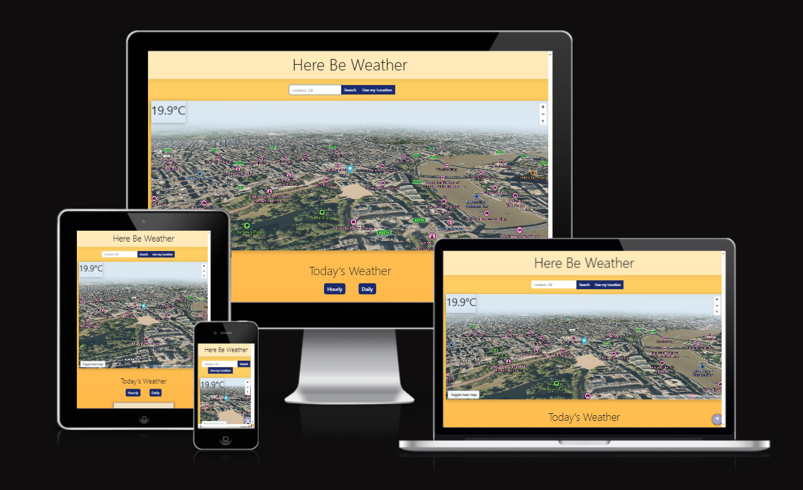
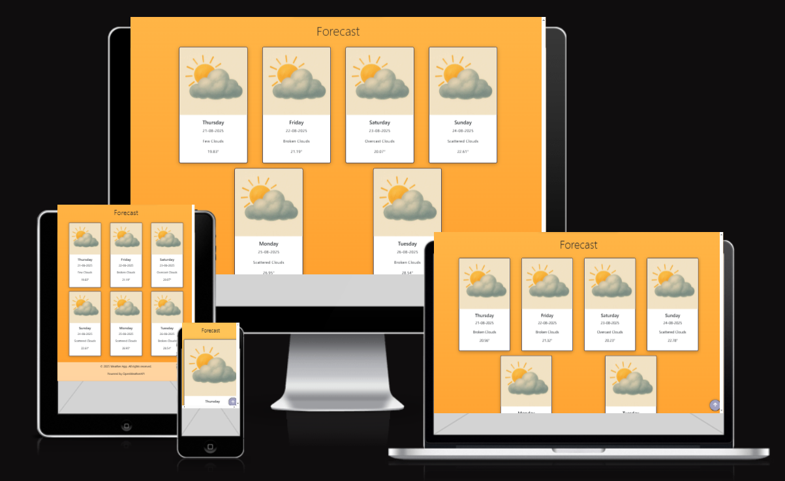
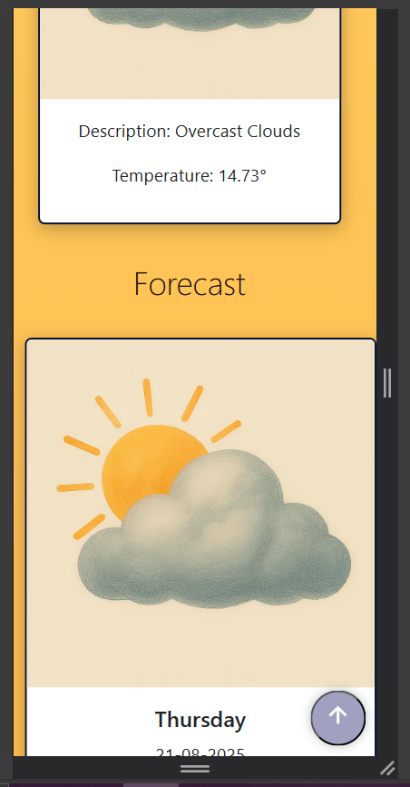
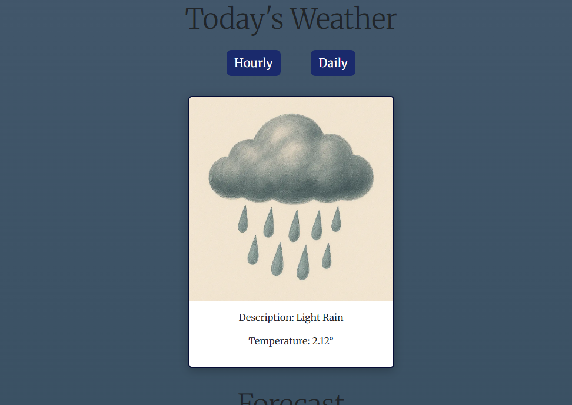

# Weather-App

## Contents

- [Live Site](#live-site)
- [Introduction](#introduction)
- [Responsivity](#responsivity)
- [User Experience](#user-experience)
- [Design](#design)
- [Website Features](#website-features)
- [Future Features](#future-features)
- [Technologies Used](#technologies-used)
  - [AI Use](#ai-use)
- [Deployment](#deployment)
- [Testing](#testing)
  - [Validation](#validation)
  - [Manual Testing](#manual-testing)
  - [Lighthouse](#lighthouse)
- [Credits](#credits)

## Live Site

## Introduction

## Responsivity

The site was fully responsive for mobile, tablet, and desktop. Screenshots of https://ui.dev/amiresponsive running our website shown below.

The map shown at startup resizes dynamically to fit the screen.

The cards in the forecast section resize dynamically to fit the screen, with 1 card showing on mobile devices, 3 cards showing on tablet devices, and 4 cards showing on desktop devices and larger. (our website seems to break the hosting site for some reason as it seems to overflow the device, this is an issue with https://ui.dev/amiresponsive rather than ours)

There seems to be a slight issue with the forecast cards on mobile devices below 700px, as the right of the card starts to align with the right edge of the screen even though there should be a margin.

<!-- ### Mobile/Tablet View -->

<!-- ### Desktop View -->

## User Experience

### Strategy

### Scope

### Structure

### Skeleton

Balsamiq Wireframes were used to plan the layout of the site. 

### Surface 
 

## Design

### Colour Scheme

### Fonts

## Website Features

### Weather Cards

The site features bootstrap cards that display the current weather and forecast for the next 5 days. The cards are designed to be visually appealing and easy to read, with clear icons and text. Each card has an image that displays a different image based on the weather conditions. The content of the cards are aquired through the OpenWeatherMap API. The cards are dynamically generated with javascript and updated based on user input and location.

There are 2 sections for the weather cards: the current weather section and the forecast section.

The current weather section displays the weather for the location specified by the user on that day.
The content of the card includes the description and temperature.

The forecast section displays the weather forecast depending on which button the user clicks (hourly or daily).

## Future Features

## Technologies Used

This site was coded with HTML, CSS, and JavaScript.

**Git** was used for version control. 

**[Github](https://github.com/)** was used to save and store the files for the site.

**[Github Pages](https://pages.github.com/)** were used to deploy the site.

**[Github Issues Project Board](https://github.com/features/issues)** was used to track progress.

**[Bootstrap](https://getbootstrap.com/)** Framework (v5.3) was used for the grid structure and responsivity throughout the site. 

**[WebAIM](https://webaim.org/resources/contrastchecker/)** was used to check the colour contrast for accessibility.

**[Sqoosh]( https://squoosh.app/)**  was used to compress images for the web.

**[Microsoft Copilot](https://copilot.microsoft.com/)** was used for image generation and debugging (see AI use section).

**[Chrome DevTools](https://developer.chrome.com/docs/devtools)** were used for debugging and testing.

**[W3 HTML Validator](https://validator.w3.org/)** was used for HTML validation.

**[W3 CSS Validator](https://validator.w3.org/)** was used for CSS validation. 

### AI Use

#### Image Generation

#### Code Generation

#### Debugging

## Deployment

This site was deployed using Github Pages. 

## Testing 

### Validation

#### HTML

[W3 HTML Validator](https://validator.w3.org/) 

#### CSS

[W3 CSS Validator](https://validator.w3.org/) 

### Manual Testing

### Lighthouse

#### Performance 

### Accessibility 

### Best Practices

### SEO

## Credits

[Copilot](https://copilot.microsoft.com/) - used for image generation (see AI use section)

[Balsamiq](https://balsamiq.com/) - used to create wireframes.

